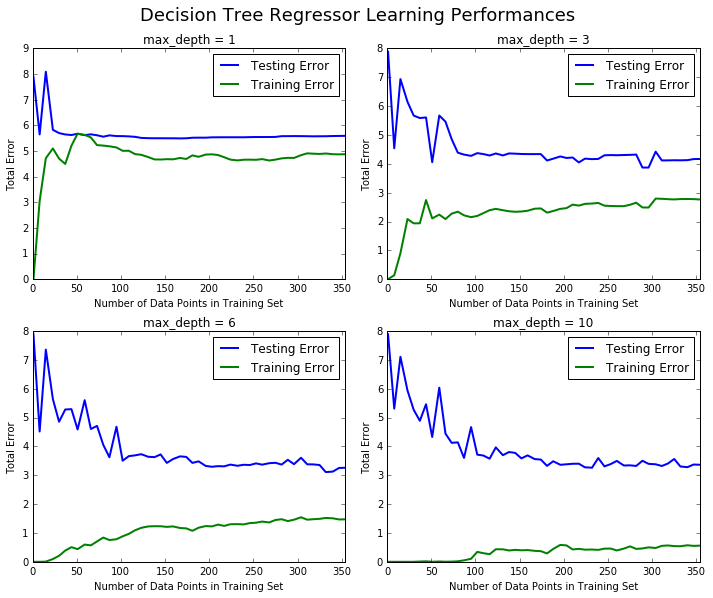
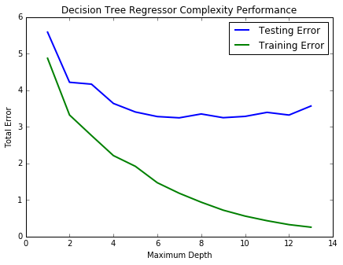

## Predicting Boston Housing Prices


**Project Description**


You want to be the best real estate agent out there. In order to compete with other agents in your area, you decide to use machine learning. You are going to use various statistical analysis tools to build the best model to predict the value of a given house. Your task is to find the best price your client can sell their house at. The best guess from a model is one that best generalizes the data.


**Data set Description**


Concerns housing values in suburbs of Boston.


**Attribute Information**


1. CRIM: per capita crime rate by town 
2. ZN: proportion of residential land zoned for lots over 25,000 sq.ft. 
3. INDUS: proportion of non-retail business acres per town 
4. CHAS: Charles River dummy variable (= 1 if tract bounds river; 0 otherwise) 
5. NOX: nitric oxides concentration (parts per 10 million) 
6. RM: average number of rooms per dwelling 
7. AGE: proportion of owner-occupied units built prior to 1940 
8. DIS: weighted distances to five Boston employment centres 
9. RAD: index of accessibility to radial highways 
10. TAX: full-value property-tax rate per dollar 10,000
11. PTRATIO: pupil-teacher ratio by town 
12. B: 1000(Bk - 0.63)^2 where Bk is the proportion of blacks by town 
13. LSTAT: % lower status of the population 
14. MEDV: Median value of owner-occupied homes in dollar 1000's

 


```python
# Importing a few necessary libraries
import numpy as np
import matplotlib.pyplot as pl
from sklearn import datasets
from sklearn.tree import DecisionTreeRegressor

# Make matplotlib show our plots inline (nicely formatted in the notebook)
%matplotlib inline

# Create our client's feature set for which we will be predicting a selling price
CLIENT_FEATURES = [[11.95, 0.00, 18.100, 0, 0.6590, 5.6090, 90.00, 1.385, 24, 680.0, 20.20, 332.09, 12.13]]

# Load the Boston Housing dataset into the city_data variable
city_data = datasets.load_boston()

# Initialize the housing prices and housing features
housing_prices = city_data.target
housing_features = city_data.data

print "Boston Housing dataset loaded successfully!"
```

    Boston Housing dataset loaded successfully!
    

# Statistical Analysis and Data Exploration
In this first section of the project, you will quickly investigate a few basic statistics about the dataset you are working with. In addition, you'll look at the client's feature set in `CLIENT_FEATURES` and see how this particular sample relates to the features of the dataset. Familiarizing yourself with the data through an explorative process is a fundamental practice to help you better understand your results.

In the code block below, use the imported `numpy` library to calculate the requested statistics. You will need to replace each `None` you find with the appropriate `numpy` coding for the proper statistic to be printed. Be sure to execute the code block each time to test if your implementation is working successfully. The print statements will show the statistics you calculate!


```python
# Number of houses in the dataset
total_houses = housing_features.shape[0]

# Number of features in the dataset
total_features = housing_features.shape[1]

# Minimum housing value in the dataset
minimum_price = np.min(housing_prices)

# Maximum housing value in the dataset
maximum_price = np.max(housing_prices)

# Mean house value of the dataset
mean_price = np.mean(housing_prices)

# Median house value of the dataset
median_price = np.median(housing_prices)

# Standard deviation of housing values of the dataset
std_dev = np.std(housing_prices)

# Show the calculated statistics
print "Boston Housing dataset statistics (in $1000's):\n"
print "Total number of houses:", total_houses
print "Total number of features:", total_features
print "Minimum house price:", minimum_price
print "Maximum house price:", maximum_price
print "Mean house price: {0:.3f}".format(mean_price)
print "Median house price:", median_price
print "Standard deviation of house price: {0:.3f}".format(std_dev)
```

    Boston Housing dataset statistics (in $1000's):
    
    Total number of houses: 506
    Total number of features: 13
    Minimum house price: 5.0
    Maximum house price: 50.0
    Mean house price: 22.533
    Median house price: 21.2
    Standard deviation of house price: 9.188
    

# Evaluating Model Performance


In the code block below,we will need implement code so that the `shuffle_split_data` function does the following:
- Randomly shuffle the input data `X` and target labels (housing values) `y`.
- Split the data into training and testing subsets, holding 30% of the data for testing.


```python
# Put any import statements you need for this code block here
from sklearn import cross_validation

def shuffle_split_data(X, y):
    
    """ Shuffles and splits data into 70% training and 30% testing subsets,
        then returns the training and testing subsets. """

    # Shuffle and split the data
    X_train, X_test, y_train,y_test=cross_validation.train_test_split(X,y,
                                      test_size=0.30,train_size=0.70,random_state=4)
    # Return the training and testing data subsets
    return X_train, y_train, X_test, y_test


# Test shuffle_split_data
try:
    X_train, y_train, X_test, y_test = shuffle_split_data(housing_features, housing_prices)
    print "Successfully shuffled and split the data!"
except:
    print "Something went wrong with shuffling and splitting the data."
```

    Successfully shuffled and split the data!
    

* Why do we split the data into training and testing subsets for our model?

while building predictive models we dont have access to future data on which we will be apllying our model and predicting the results but we want to simulate this process so we split some part of data as training on which we will train our model and other part as test on which we will test and match our results with the already known labels and evaluate the results and accuracies of our model.

In the code block below,we will to implement code so that the `performance_metric` function does the following:
- Perform a total error calculation between the true values of the `y` labels `y_true` and the predicted values of the `y` labels `y_predict`.


```python
# Put any import statements you need for this code block here
from sklearn.metrics import mean_absolute_error
import numpy as np
def performance_metric(y_true, y_predict):
    """ Calculates and returns the total error between true and predicted values
        based on a performance metric chosen by the student. """
    #print accuracy_score(y_true,y_predict)
    error = mean_absolute_error(y_true, y_predict)
    return error

performance_metric(y_train,y_train)
# Test performance_metric
try:
    total_error = performance_metric(y_train , y_train)
    #print total_error
    print "Successfully performed a metric calculation!"
except:
    print "Something went wrong with performing a metric calculation."
```

    Successfully performed a metric calculation!
    

* Which performance metric below did you find was most appropriate for predicting housing prices and analyzing the total error. Why?

- *Accuracy*
- *Precision*
- *Recall*
- *F1 Score*
- *Mean Squared Error (MSE)*
- *Mean Absolute Error (MAE)*

The choice of performance metric depends on what is important for the application that you are interested in. The MSE is a good performance metric for many applications as there is good reason to suppose that noise process is Gaussian. Sometimes it is better to use the MAE if you don't want your performance metric to be overly sensitive to outliers.As house price prediction is a regression problem i.e. problem involving continuous numerical data,and as we examine the outliers in our housing prices dataset MSE is very sensitive to outliers producing large errors as the difference between actual and predicted value is squared while in MAE the difference of  actual and predicted value so we can better analyze the total error.

In the code block below, you will need to implement code so that the `fit_model` function does the following:
- Create a scoring function using the same performance metric. See the [sklearn `make_scorer` documentation]
- Build a GridSearchCV object using `regressor`, `parameters`, and `scoring_function`. 


```python
# Put any import statements you need for this code block
from sklearn.metrics import mean_absolute_error
from sklearn.grid_search import GridSearchCV
from sklearn.metrics import make_scorer
def fit_model(X, y):
    """ Tunes a decision tree regressor model using GridSearchCV on the input data X 
        and target labels y and returns this optimal model. """

    # Create a decision tree regressor object
    regressor = DecisionTreeRegressor()

    # Set up the parameters we wish to tune
    parameters = {'max_depth':(1,2,3,4,5,6,7,8,9,10)}

    # Make an appropriate scoring function
    scoring_function = make_scorer(mean_absolute_error,greater_is_better=False)

    # Make the GridSearchCV object
    reg = GridSearchCV(regressor, parameters, scoring_function)

    # Fit the learner to the data to obtain the optimal model with tuned parameters
    reg.fit(X, y)

    # Return the optimal model
    return reg.best_estimator_


# Test fit_model on entire dataset
try:
    reg = fit_model(housing_features, housing_prices)
    print "Successfully fit a model!"
except:
    print "Something went wrong with fitting a model."
```

    Successfully fit a model!
    

*What is the grid search algorithm and when is it applicable?*

Grid Search is an exhaustive searching through a manually specified subset of parameters for a learning algorithm.Grid search works by taking values of the parameters defined and  doing a cross product of these different paramets value,trains the algorithm with each of the parameter set and evaluates their performance using the performance metric specified in the grid search algorithm to give optimum finely tuned results.Its applicable in fine tuning an algorithm which takes up certain paramets like SVM takes parameters like C,GAMMA,KERNEL etc.

*What is cross-validation, and how is it performed on a model? Why would cross-validation be helpful when using grid search?*

Cross validation, especially on K-fold CV - the data set is divided into k subsets, and the holdout method is repeated k times. Each time, one of the k subsets is used as the test set and the other k-1 subsets are put together to form a training set. Then the average error across all k trials is computed. The advantage of this method is that it matters less how the data gets divided. Every data point gets to be in a test set exactly once, and gets to be in a training set k-1 times.In respect to above description cross validation maximizes training and testing data,especially when we have limited data size,As in grid search algorithm we have to fine tune the learning algorithm and perform an exhaustive search using the parameters defined we need more data and a variety of data to check out these parameter values and optimum results therefore CV gives us the advantage of virtually providing more data to train and test using grid search then we actually have.


```python
def learning_curves(X_train, y_train, X_test, y_test):
    """ Calculates the performance of several models with varying sizes of training data.
        The learning and testing error rates for each model are then plotted. """
    
    print "Creating learning curve graphs for max_depths of 1, 3, 6, and 10. . ."
    
    # Create the figure window
    fig = pl.figure(figsize=(10,8))

    # We will vary the training set size so that we have 50 different sizes
    sizes = np.rint(np.linspace(1, len(X_train), 50)).astype(int)
    train_err = np.zeros(len(sizes))
    test_err = np.zeros(len(sizes))

    # Create four different models based on max_depth
    for k, depth in enumerate([1,3,6,10]):
        
        for i, s in enumerate(sizes):
            
            # Setup a decision tree regressor so that it learns a tree with max_depth = depth
            regressor = DecisionTreeRegressor(max_depth = depth)
            
            # Fit the learner to the training data
            regressor.fit(X_train[:s], y_train[:s])

            # Find the performance on the training set
            train_err[i] = performance_metric(y_train[:s], regressor.predict(X_train[:s]))
            
            # Find the performance on the testing set
            test_err[i] = performance_metric(y_test, regressor.predict(X_test))

        # Subplot the learning curve graph
        ax = fig.add_subplot(2, 2, k+1)
        ax.plot(sizes, test_err, lw = 2, label = 'Testing Error')
        ax.plot(sizes, train_err, lw = 2, label = 'Training Error')
        ax.legend()
        ax.set_title('max_depth = %s'%(depth))
        ax.set_xlabel('Number of Data Points in Training Set')
        ax.set_ylabel('Total Error')
        ax.set_xlim([0, len(X_train)])
    
    # Visual aesthetics
    fig.suptitle('Decision Tree Regressor Learning Performances', fontsize=18, y=1.03)
    fig.tight_layout()
    fig.show()
```


```python
def model_complexity(X_train, y_train, X_test, y_test):
    """ Calculates the performance of the model as model complexity increases.
        The learning and testing errors rates are then plotted. """
    
    print "Creating a model complexity graph. . . "

    # We will vary the max_depth of a decision tree model from 1 to 14
    max_depth = np.arange(1, 14)
    train_err = np.zeros(len(max_depth))
    test_err = np.zeros(len(max_depth))

    for i, d in enumerate(max_depth):
        # Setup a Decision Tree Regressor so that it learns a tree with depth d
        regressor = DecisionTreeRegressor(max_depth = d)

        # Fit the learner to the training data
        regressor.fit(X_train, y_train)

        # Find the performance on the training set
        train_err[i] = performance_metric(y_train, regressor.predict(X_train))

        # Find the performance on the testing set
        test_err[i] = performance_metric(y_test, regressor.predict(X_test))

    # Plot the model complexity graph
    pl.figure(figsize=(7, 5))
    pl.title('Decision Tree Regressor Complexity Performance')
    pl.plot(max_depth, test_err, lw=2, label = 'Testing Error')
    pl.plot(max_depth, train_err, lw=2, label = 'Training Error')
    pl.legend()
    pl.xlabel('Maximum Depth')
    pl.ylabel('Total Error')
    pl.show()
```

# Analyzing Model Performance
we'll take a look at several models' learning and testing error rates on various subsets of training data. Additionally, you'll investigate one particular algorithm with an increasing `max_depth` parameter on the full training set to observe how model complexity affects learning and testing errors. Graphing your model's performance based on varying criteria can be beneficial in the analysis process, such as visualizing behavior that may not have been apparent from the results alone.


```python
learning_curves(X_train, y_train, X_test, y_test)
```

    Creating learning curve graphs for max_depths of 1, 3, 6, and 10. . .
    





*Choose one of the learning curve graphs that are created above. What is the max depth for the chosen model? As the size of the training set increases, what happens to the training error? What happens to the testing error?*

I chose the figure having max depth 6.As the size of training set increases training error increases but testing error has two stages initially testing error is high but as test size increases the algorithm is learning and thus testing error decreases but as we move further and train our model more and more testing erro tend to saturate or become somewhat constant because it has strained with all the data we are having and already learnt what it can with that amount of data. 


Look at the learning curve graphs for the model with a max depth of 1 and a max depth of 10. When the model is using the full training set, does it suffer from high bias or high variance when the max depth is 1? What about when the max depth is 10?*

 when max depth is 1 it is suffering from high bias,as model has not understood the training data well also training and testing errors are very high and close,While when max depth is increased to 10 its suffering from high variance and the model has overfitted the data we have provided as we see the difference in training and testing errors tend to increase i.e.model is now only learning the given data it will be unable to generalize new data well.


```python
model_complexity(X_train, y_train, X_test, y_test)
```

    Creating a model complexity graph. . . 
    





*From the model complexity graph above, describe the training and testing errors as the max depth increases. Based on your interpretation of the graph, which max depth results in a model that best generalizes the dataset? Why?*

In this graph there are three phases as max depth increases,initially the model is underfitted and the training error is extremely high then there is point where training error decreases at the expense of generalization,a optimum point where high bias/high variance tradeoff is minumum.Then in third phase model is overfitted and difference between training and testing error is high.Hence,Max depth 6 best generalizes the dataset,because the total error as compared to other nearby max depth 3,4,5,8 etc is lower and as we see at max depth 6 high bias/high variance tradeoff is optimum,as before max depth 6 error is high and near 6 it is decreasing and after 6 it starts increasing and if we talk about training error,as it is decreasing further model is overfitting but at max depth 6 the diference gap between testing and training error is optimum.

# Model Prediction
Now,we will make a prediction on the client's feature set using an optimized model from `fit_model`. When applying grid search along with cross-validation to optimize your model, it would typically be performed and validated on a training set and subsequently evaluated on a **dedicated test set**. In this project, the optimization below is performed on the *entire dataset* (as opposed to the training set you made above) due to the many outliers in the data. Using the entire dataset for training provides for a less volatile prediction at the expense of not testing your model's performance. 


*Using grid search on the entire dataset, what is the optimal `max_depth` parameter for your model? How does this result compare to your intial intuition?*  


```python
print "Final model has an optimal max_depth parameter of", reg.get_params()['max_depth']
```

    Final model has an optimal max_depth parameter of 4
    

Final model has an optimal max_depth parameter of 4.The max depth parameter i guessed i.e 6 is close to this result but there will always be a tradeoff of high bias/high variance,in max depth 4 we see difference between training and testing error is less but training error is still high,i.e. model is still needs to understood the data while in max depth 6 the testing error reduces and reaches to a optimum value,while difference between training and testing error is a bit high.


*With your parameter-tuned model, what is the best selling price for your client's home? How does this selling price compare to the basic statistics you calculated on the dataset?*  


```python
sale_price = reg.predict(CLIENT_FEATURES)
print "Predicted value of client's home: {0:.3f}".format(sale_price[0])
```

    Predicted value of client's home: 21.630
    

21.630.This validates that 68% of the data is found one standard deviation near to mean.
